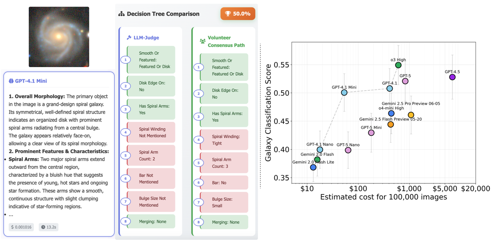
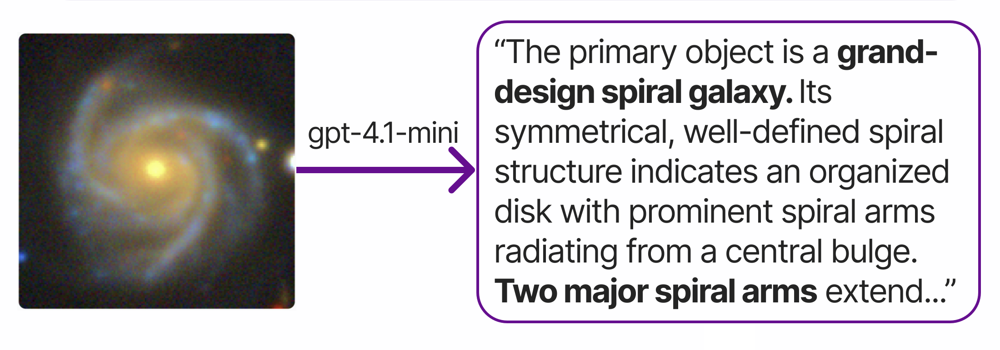
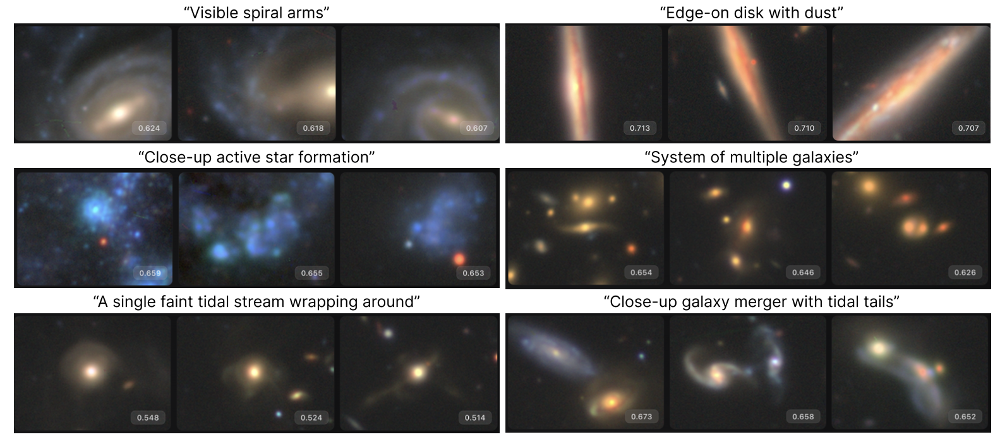
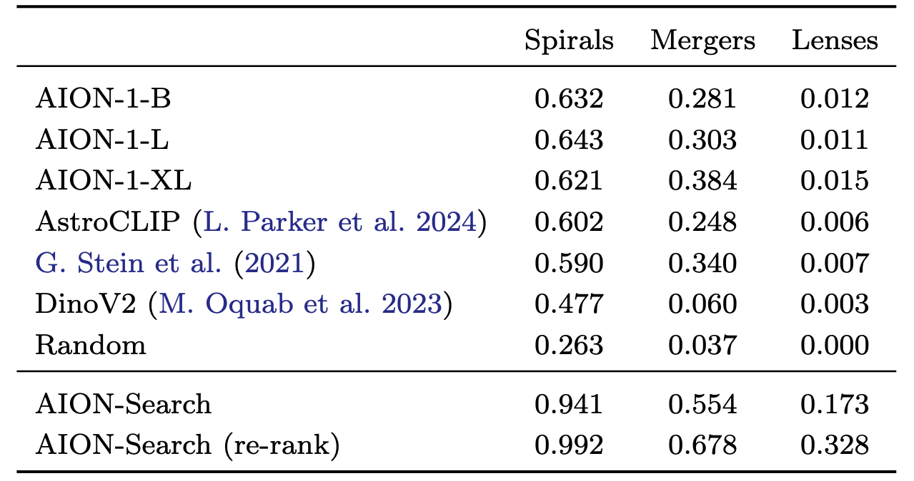
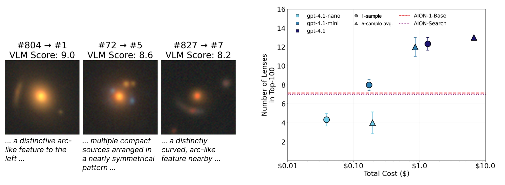

# Research Code

**This code is provided as a reference implementation only.**

For runnable code, see the main [`aionsearch/`](../aionsearch/) package and [`examples/`](../examples/) directory.

## Paper Implementation Overview

The paper presents three main contributions, each corresponding to different parts of the codebase. First, we evaluate whether Vision-Language Models (VLMs, e.g. GPT-4) can accurately describe galaxy images by benchmarking them against human annotations from Galaxy Zoo. Second, we use these VLM-generated descriptions to train a contrastive model that aligns image embeddings with text embeddings. Third, we demonstrate that VLM re-ranking can significantly improve retrieval performance for rare astronomical phenomena.

## VLM Benchmarking

Figure 1 shows the accuracy-cost trade-off for 14 Vision-Language Model configurations on our Galaxy Zoo benchmark. This analysis is implemented in `prompt_optimization/plot_performance_vs_cost.py`, which reads evaluation results from JSONL files containing model responses and their associated costs. The script loads pricing information from `src/utils/models.jsonl` and calculates the cost to caption 100,000 images for each model.

## Training Pipeline

The core contribution of our paper is the AION-Search model, which enables semantic search over astronomical images. The training pipeline, implemented as a sequence of numbered scripts in `src/`, transforms unlabeled galaxy images into a searchable semantic space through six stages. These numbered scripts are provenance code rather than a one-command public rerun of the full training process; see `src/README.md` for the training runbook, generated-artifact manifest, and frozen Hugging Face artifact mapping.

The pipeline begins with `01_collect_galaxies.py`, which samples 300,000 galaxy images from the Multi Modal Universe dataset, split between HSC and Legacy Survey telescopes. These images are selected using only a simple brightness cut to avoid biasing the model toward specific morphological types. Next, `02a_generate_descriptions_batch.py` uses OpenAI's batch API to generate descriptions for each image using GPT-4.1-mini with our optimized prompt. This script manages the asynchronous batch processing, handling retries and failures gracefully. The total cost for generating descriptions for 300,000 images is approximately $150.

Following description generation, `03a_generate_augmented_descriptions_batch.py` creates single-sentence summaries of the longer descriptions using GPT-4.1-nano. The script `04_generate_text_embeddings.py` then embeds both the original descriptions and summaries using OpenAI's text-embedding-3-large model, producing 3072-dimensional vectors that capture semantic content.

The preparation phase concludes with `05_generate_unified_embeddings.py`, which combines the text embeddings with pre-computed AION image embeddings and creates the unified parquet consumed by training. The benchmark-overlap exclusion is applied by `06_train_clip.py` through the configured crossmatch CSV. `06_train_clip.py` then implements the contrastive learning that aligns AION's image encoder with the text embedding space. The training uses shallow MLPs as projection heads and optimizes an InfoNCE loss to learn a shared 1024-dimensional embedding space.

## Evaluation Infrastructure

The paper's main results comparing AION-Search to baselines appear in Figure 2 and the accompanying table. The current evaluation pipeline is implemented in `src/experiments/retrieval/`. It evaluates AION and AION-Search retrieval on GZ-DECaLS spirals/mergers and gravitational lenses, using nDCG@10 on Hugging Face-hosted embeddings and relevance labels.

For spirals and mergers, the evaluation uses Galaxy Zoo DECaLS labels where each image has a relevance score equal to the fraction of volunteers identifying that feature. For lenses, the evaluation uses a parent sample cross-matched against published lens catalogs. See `src/experiments/retrieval/README.md` for the canonical commands, expected full-dataset results, 10-fold results, and lens sensitivity analysis.

The older `src/experiments/aion_table4/` implementation has been removed from this research archive because it is superseded by the unified retrieval pipeline.

## Re-ranking Experiments

Figure 3 presents re-ranking results, showing how VLMs can verify and improve initial search results. The controlled HSC lens experiment discussed in the re-ranking section is now collected in `src/experiments/hsc_lens_rerank/`, including sample construction, AION-Search baseline ranking, the GPT-4.1 re-ranking grid, and plotting.

The broader retrieval-table re-ranking path lives in `src/experiments/retrieval/rerank.py`, with image preparation in `src/experiments/retrieval/download_images.py`.

## Galaxy10 Classification

The Galaxy10 comparison is implemented in `src/experiments/gz10/`. This pipeline prepares AION-Search embeddings for the Galaxy10 test split, evaluates zero-shot label retrieval, generates VLM descriptions, and runs LLM-based classification baselines. See `src/experiments/gz10/README.md` for the step-by-step commands.

## Stream Catalog Comparison

The stream candidate comparison code lives in `src/experiments/stream_finding/`. It extracts or loads published tidal-feature and stellar-stream catalogs, consolidates them, and compares the AION-Search stream candidates against the existing catalog set.
